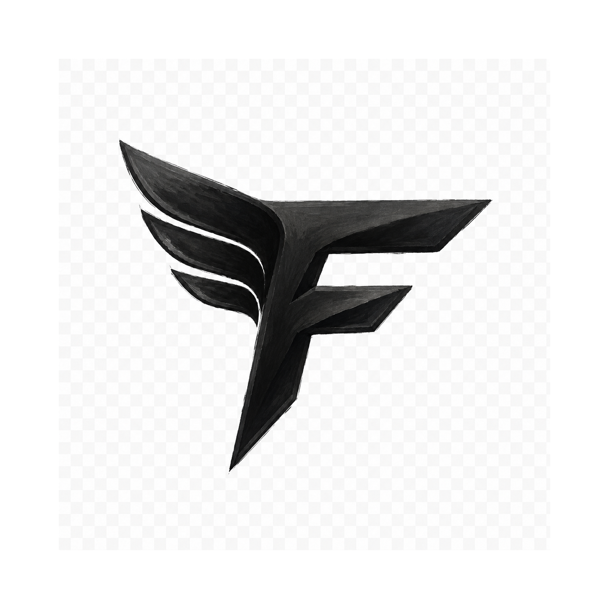
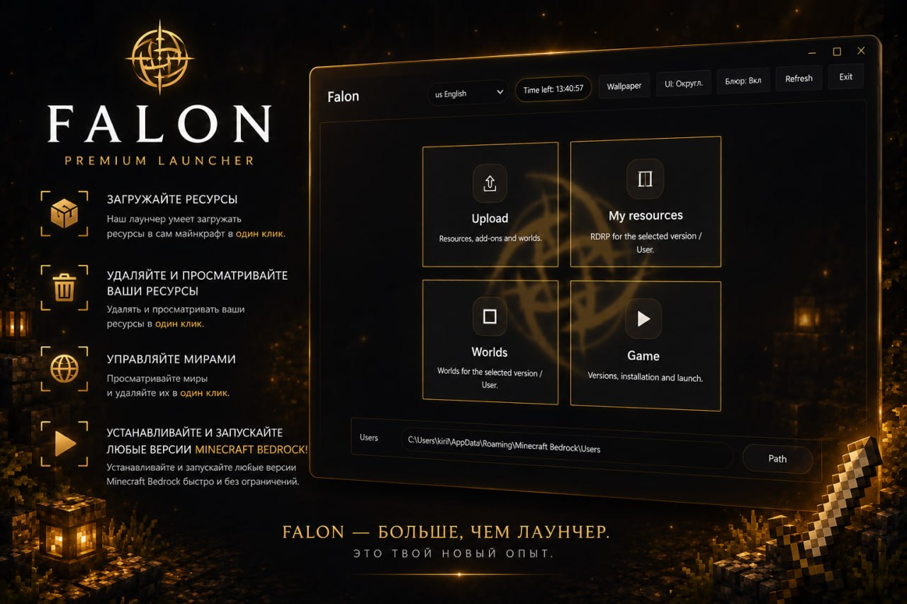

<p align="center">
  
</p>

<h1 align="center">Falon Client</h1>

<p align="center">
  A clean Minecraft Bedrock launcher and content manager for Windows.
</p>

<p align="center">
  
  
  
</p>

<p align="center">
  <a href="#features">Features</a> ·
  <a href="#installation">Installation</a> ·
  <a href="#screenshots">Screenshots</a> ·
  <a href="#security-note">Security</a>
</p>

---

## About

**Falon Client** is a desktop launcher for managing Minecraft Bedrock / Windows versions, worlds, resource packs, behavior packs, and legacy UWP builds from one polished interface.

It is built for a smooth, visual workflow: pick a version, install content, manage profiles, and launch the game without digging through Windows folders manually.

## Features

- **Version manager** — browse, download, install, and launch Minecraft Bedrock versions.
- **Legacy UWP support** — helper flow for older Appx/UWP builds.
- **Content installer** — install `.mcpack`, `.mcaddon`, `.mcworld`, and `.zip` packages.
- **Worlds and packs tools** — manage worlds, resource packs, and behavior packs per profile.
- **Custom UI** — animated splash screen, wallpaper support, blur toggle, rounded/square UI modes.
- **Multi-language interface** — English, Russian, Kazakh, Ukrainian, and Turkish UI support.
- **Safe launch handling** — timeout protection and fallback launch paths for Appx/UWP versions.

## Screenshots

<p align="center">
  
</p>

## Installation

Public releases are distributed from the **Releases** page.

1. Download the latest installer.
2. Run `Falon Setup`.
3. Open Falon Client and choose your Minecraft data path if needed.

## Development

```powershell
npm install
npm start
```

> This public repository intentionally does not include private license vaults, generated keys, installers, or local debug/audit files.

## Repository contents

The public repo contains only the Falon Client source and public assets needed for presentation/development.

Not included:

- generated license keys;
- local key vaults;
- build artifacts and installers;
- private debug/audit data;
- local environment files.

## Roadmap

- Cleaner releases and changelog.
- More screenshots and short demo clips.
- Improved version availability indicators.
- Better first-run onboarding.
- Optional GitHub Actions build pipeline.

## Security note

If you find a vulnerability or a way to expose private keys/build assets, please do **not** open a public issue. See [`SECURITY.md`](SECURITY.md).

## License

License information will be added before the first public release.
